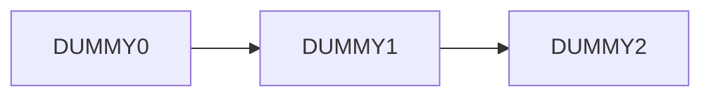
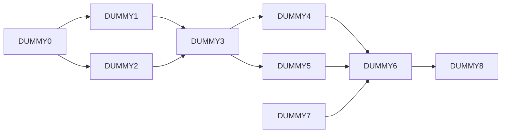

# MyISP

## Features:

算法级: 
- 使用函数式编程, 抽象化算法设计, 独立性好, 可复用,可组合; 接口统一, 提高开发效率;
- 目前完成的算法包括: 可灵活配置滤波核的滤波操作, 小波变换(二代方法); Star-Tetrix变换; CCM等.

模块级: 
- 合理封装算法, 作为算法与pipeline的衔接, 也解除算法与pipeline的耦合, 降低维护难度.

管线级: 
- 支持配置DAG (有向无环图) 定义 pipeline 拓扑结构, 支持带延迟的输入, 快速仿真任何ISP pipeline
- 使用哈希表系统化、层次化管理算法配置参数, 同时适配可变的pipeline结构.
- 配置内容最小化, 尽量避免人为的输入错误


## 使用说明:

如何配置 pipeline:

***(目前未做 “通过 config 文件定义 pipeline 拓扑结构” 的功能, 做好后更新)***

<!-- 首先我们思考一下 pipeline 是由哪些东西定义的:

- pipeline 是由很多模块组成的, 它们之间的依赖关系可以用一个有向无环图表示, 因此需要这样一个图, 来定义**各个模块的依赖关系**;

- 考虑到可能有的模块需要历史帧的输入, 仅有一个有向无环图就无法表示了, 所以在此基础上, 还需要定义**历史帧的依赖关系**; 

- 由于算法的参列表顺序是定死的, 如果一个模块需要多个输入图像(一般是从其他模块输出的), 还需**要根据算法参列表顺序**定义该模块的**输入图像的接收顺序**.

所以需要从以上三个维度来定义 pipeline. 

并不是所有的 pipeline 都有复杂的结构, 简单的 pipeline 不需要写全所有三个维度来定义. 下面举例说明: -->

根据 pipeline 的结构的复杂程度, 可分为以下 3 种:

### 第一种: 最简单的级联



用代码的语言描述其拓扑结构:
```cpp
int n = 3; // number of nodes
Graph_t graph(n);

graph[0] = {DUMMY0, {DUMMY1}}; // the directed edges are implicitly shown as from DUMMY0 to DUMMY1
graph[1] = {DUMMY1, {DUMMY2}}; // the directed edges are implicitly shown as from DUMMY1 to DUMMY2
graph[2] = {DUMMY2, {}}; 
```

用此拓扑结构初始化 pipeline 并打印信息:

```cpp
Pipeline myPipe(graph, true); // true 表示要打印信息
```
terminal 输出:

```
pipe:
DUMMY0:   needs no input;   delivers output to: DUMMY1, 
DUMMY1:   takes input(s) from: DUMMY0,   delivers output to: DUMMY2, 
DUMMY2:   takes input(s) from: DUMMY1,   dose not deliver output; 
```

### 第二种: 有向无环图



用代码的语言描述其拓扑结构:

```cpp

int n = 9; // number of nodes
Graph_t graph(n);

// 有向图的表示, 用的 Adjacent List (邻接表):
graph[0] = {DUMMY0, {DUMMY1, DUMMY2}}; // the directed edges are implicitly shown as from DUMMY0 to DUMMY1, and from DUMMY0 to DUMMY2
graph[1] = {DUMMY1, {DUMMY3}}; // the directed edges are implicitly shown as from DUMMY1 to DUMMY3
graph[2] = {DUMMY2, {DUMMY3}}; // the directed edges are implicitly shown as from DUMMY2 to DUMMY3
graph[3] = {DUMMY3, {DUMMY4, DUMMY5}}; // and so on ...
graph[4] = {DUMMY4, {DUMMY6}};
graph[5] = {DUMMY5, {DUMMY6}};
graph[6] = {DUMMY6, {DUMMY8}};
graph[7] = {DUMMY7, {DUMMY6}}; 
graph[8] = {DUMMY8, {}};

// 由于算法的参列表顺序是定死的, 如果一个模块需要多个输入图像(一般是从其他模块输出的), 还需**要根据算法参列表顺序**定义该模块的**输入图像的接收顺序**
Orders_t orders;
orders.push_back({DUMMY3, {{DUMMY1}, {DUMMY2}}}); // mind the syntax! {DUMMY1} is actually {DUMMY1, 0}, the 0 is default and therefore omitted.
orders.push_back({DUMMY6, {{DUMMY4}, {DUMMY5}, {DUMMY7}}});
```

用此拓扑结构初始化 pipeline 并打印信息:

```cpp
// graph 是刚才的邻接表, orders 是刚才的输入图像的接收顺序, true 表示要打印信息:
Pipeline myPipe(graph, orders, true);
```
terminal 输出:
```
pipe:
DUMMY7:   needs no input;   delivers output to: DUMMY6, 
DUMMY0:   needs no input;   delivers output to: DUMMY1, DUMMY2, 
DUMMY2:   takes input(s) from: DUMMY0,   delivers output to: DUMMY3, 
DUMMY1:   takes input(s) from: DUMMY0,   delivers output to: DUMMY3, 
DUMMY3:   takes input(s) from: DUMMY1, DUMMY2,   delivers output to: DUMMY4, DUMMY5, 
DUMMY5:   takes input(s) from: DUMMY3,   delivers output to: DUMMY6, 
DUMMY4:   takes input(s) from: DUMMY3,   delivers output to: DUMMY6, 
DUMMY6:   takes input(s) from: DUMMY4, DUMMY5, DUMMY7,   delivers output to: DUMMY8, 
DUMMY8:   takes input(s) from: DUMMY6,   dose not deliver output; 
```


### 第三种: 有向无环图+历史帧

```mermaid
  flowchart LR;
  t0D3[DUMMY3]-->t1D3[DUMMY3]
  t1D3[DUMMY3]-->t2D3[DUMMY3]
  t0D1[DUMMY1]-->t1D2[DUMMY2]
  t1D1[DUMMY1]-->t2D2[DUMMY2]
  
  
    subgraph time t = 0
    direction LR
    t0D0[DUMMY0]-->t0D1[DUMMY1]
    t0D0[DUMMY0]-->t0D2[DUMMY2]
    t0D1[DUMMY1]-->t0D3[DUMMY3]
    t0D2[DUMMY2]-->t0D3[DUMMY3]
    end

    subgraph time t = 1
    direction LR
    t1D0[DUMMY0]-->t1D1[DUMMY1]
    t1D0[DUMMY0]-->t1D2[DUMMY2]
    t1D1[DUMMY1]-->t1D3[DUMMY3]
    t1D2[DUMMY2]-->t1D3[DUMMY3]
    end

    subgraph time t = 2
    direction LR
    t2D0[DUMMY0]-->t2D1[DUMMY1]
    t2D0[DUMMY0]-->t2D2[DUMMY2]
    t2D1[DUMMY1]-->t2D3[DUMMY3]
    t2D2[DUMMY2]-->t2D3[DUMMY3]
    end

```

用代码的语言描述其拓扑结构:

```cpp
int n = 4; // number of nodes
Graph_t graph(n);

graph[0] = {DUMMY0, {DUMMY1, DUMMY2}}; // the directed edges are implicitly shown as from DUMMY0 to DUMMY1, and from DUMMY0 to DUMMY2
graph[2] = {DUMMY1, {DUMMY3}}; // the directed edges are implicitly shown as from DUMMY1 to DUMMY3
graph[1] = {DUMMY2, {DUMMY3}}; // the directed edges are implicitly shown as from DUMMY2 to DUMMY3
graph[3] = {DUMMY3, { }};

// 考虑到可能有的模块需要历史帧的输入, 仅有一个有向无环图就无法表示了, 所以在此基础上, 还需要定义**历史帧的依赖关系**; 
DelayGraph_t delayGraph;
delayGraph.push_back({DUMMY3, {{DUMMY3, 1}}}); // 表示 DUMMY3 的输出要给到 1帧之后 的 DUMMY3
delayGraph.push_back({DUMMY1, {{DUMMY2, 1}}}); // 表示 DUMMY1 的输出要给到 1帧之后 的 DUMMY2

// 同理, 输入图像的接收顺序, 不要忘了考虑历史帧
Orders_t orders;
orders.push_back({DUMMY3, {{DUMMY1 }, {DUMMY2 }, {DUMMY3, 1}}}); //表示 DUMMY3 的 3个输入的提供者按顺序分别是: DUMMY1(本帧), DUMMY2(本帧), DUMMY3(1帧之前)
orders.push_back({DUMMY2, {{DUMMY0 }, {DUMMY1, 1}}}); // 表示 DUMMY2 的2个输入的提供者按顺序分别是: DUMMY0(本帧), DUMMY1(1帧之前)
```

用此拓扑结构初始化 pipeline 并打印信息:

```cpp
Pipeline myPipe(graph, delayGraph, orders, true); // true 表示要打印信息
```
terminal 输出:
```
pipe:
DUMMY0:   needs no input;   delivers output to: DUMMY1, DUMMY2, 
DUMMY2:   takes input(s) from: DUMMY0, DUMMY1(last frame),   delivers output to: DUMMY3, 
DUMMY1:   takes input(s) from: DUMMY0,   delivers output to: DUMMY3, DUMMY2(next frame), 
DUMMY3:   takes input(s) from: DUMMY1, DUMMY2, DUMMY3(last frame),   delivers output to: DUMMY3(next frame), 
```
