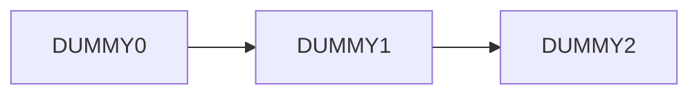
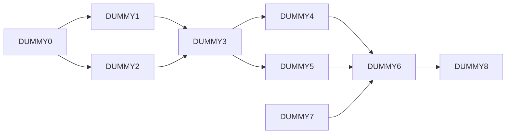

# MyISP

## Features:

算法级: 
- 使用函数式编程, 抽象化算法设计, 独立性好, 可复用,可组合; 接口统一, 提高开发效率;
- 目前完成的算法包括: 可灵活配置滤波核的滤波操作, 小波变换(二代方法); Star-Tetrix变换; CCM等.

模块级: 
- 合理封装算法, 作为算法与pipeline的衔接, 也解除算法与pipeline的耦合, 降低维护难度.

管线级: 
- 支持配置DAG (有向无环图) 定义 pipeline 拓扑结构, 支持带延迟的输入, 快速仿真任何ISP pipeline
- 使用哈希表系统化、层次化管理算法配置参数, 同时适配可变的pipeline结构.
- 配置内容最小化, 尽量避免人为的输入错误


## 使用说明:

### 如何配置 pipeline:


<!-- 首先我们思考一下 pipeline 是由哪些东西定义的:

- pipeline 是由很多模块组成的, 它们之间的依赖关系可以用一个有向无环图表示, 因此需要这样一个图, 来定义**各个模块的依赖关系**;

- 考虑到可能有的模块需要历史帧的输入, 仅有一个有向无环图就无法表示了, 所以在此基础上, 还需要定义**历史帧的依赖关系**; 

- 由于算法的参列表顺序是定死的, 如果一个模块需要多个输入图像(一般是从其他模块输出的), 还需**要根据算法参列表顺序**定义该模块的**输入图像的接收顺序**.

所以需要从以上三个维度来定义 pipeline. 

并不是所有的 pipeline 都有复杂的结构, 简单的 pipeline 不需要写全所有三个维度来定义. 下面举例说明: -->

配置文件是 .toml 格式的, 了解 TOML 的语法可以看他们的[官网](https://toml.io/en/v1.0.0)

假设我们的 pipeline 由各个模块组成, 名字分别为 DUMMY0, DUMMY1, DUMMY2, ..., 根据 pipeline 的结构的复杂程度, 可分为以下 3 种:

#### 第一种: 最简单的级联



<!-- 用代码的语言描述其拓扑结构:
```cpp
int n = 3; // number of nodes
Graph_t graph(n);

graph[0] = {DUMMY0, {DUMMY1}}; // the directed edges are implicitly shown as from DUMMY0 to DUMMY1
graph[1] = {DUMMY1, {DUMMY2}}; // the directed edges are implicitly shown as from DUMMY1 to DUMMY2
graph[2] = {DUMMY2, {}}; 
``` -->
在 .toml 文件里我们用一个名为 `graphNoDelay` 的数组描述这结构.  
`graphNoDelay` 的每一个元素仍是数组, 长度为2, 其中:
- 第一个元素为模块 (或者叫节点) 的名字, 
- 第二个元素是 长度大于等于1 的数组, 每个元素为这个模块(节点)的后继模块的名字. 如果没有后继, 就写一个空字符串 `''`, 不要什么都不写.  

pipeline 的每一个模块都要像这样定义 (即, [模块名, [后继模块名]]), **不分先后** 地列写在 `graphNoDelay` 数组之中, 用逗号隔开. 实际上 `graphNoDelay` 就是图的 “邻接表” 定义方法.

```toml
graphNoDelay = [
    # EVERY node in pipe should be defined here:
    [   # 缩进不是必须的, 只是为了好看
        'DUMMY0',  # a node in the pipe topology
        ['DUMMY1']  # the no-delay-successors of this node
    ],
    [
        'DUMMY1',
        ['DUMMY2']   
    ],
    [
        'DUMMY2',
        [''] # if no successor module, just enter an empty string. do not leave it blank.
    ]
]
```

这个例子放在了 [pipeCfg/pipeCfgDummy1.toml](pipeCfg/pipeCfgDummy1.toml), 用此拓扑结构初始化 pipeline 并打印信息:

```cpp
Pipeline myPipe("../pipeCfg/pipeCfgDummy1.toml", true); // true 表示要打印信息
```
运行后, terminal 输出:

```
pipe:
1) DUMMY0:   needs no input;   delivers output to: DUMMY1, 
2) DUMMY1:   takes input(s) from: DUMMY0,   delivers output to: DUMMY2, 
3) DUMMY2:   takes input(s) from: DUMMY1,   dose not deliver output; 
```
可以看到序号 “1) 2) 3)” 对应的是模块的执行顺序. 其实 pipeline 会根据 `graphNoDelay` 将所有的模块进行拓扑排序, 保证每个模块执行的时候, 它的前置模块 (即它依赖的模块) 已经执行完了.

另外就是, 由于模块执行顺序是拓扑排序后的顺序, 此 pipeline 是**单线程**的, 不可同时运行 2 个模块.

#### 第二种: 有向无环图



<!-- 用代码的语言描述其拓扑结构:

```cpp

int n = 9; // number of nodes
Graph_t graph(n);

// 有向图的表示, 用的 Adjacent List (邻接表):
graph[0] = {DUMMY0, {DUMMY1, DUMMY2}}; // the directed edges are implicitly shown as from DUMMY0 to DUMMY1, and from DUMMY0 to DUMMY2
graph[1] = {DUMMY1, {DUMMY3}}; // the directed edges are implicitly shown as from DUMMY1 to DUMMY3
graph[2] = {DUMMY2, {DUMMY3}}; // the directed edges are implicitly shown as from DUMMY2 to DUMMY3
graph[3] = {DUMMY3, {DUMMY4, DUMMY5}}; // and so on ...
graph[4] = {DUMMY4, {DUMMY6}};
graph[5] = {DUMMY5, {DUMMY6}};
graph[6] = {DUMMY6, {DUMMY8}};
graph[7] = {DUMMY7, {DUMMY6}}; 
graph[8] = {DUMMY8, {}};

// 由于算法的参列表顺序是定死的, 如果一个模块需要多个输入图像(一般是从其他模块输出的), 还需**要根据算法参列表顺序**定义该模块的**输入图像的接收顺序**
Orders_t orders;
orders.push_back({DUMMY3, {{DUMMY1}, {DUMMY2}}}); // mind the syntax! {DUMMY1} is actually {DUMMY1, 0}, the 0 is default and therefore omitted.
orders.push_back({DUMMY6, {{DUMMY4}, {DUMMY5}, {DUMMY7}}});
``` -->

在 .toml 文件里我们用一个名为 `graphNoDelay` 的数组和一个名为 `orders` 的数组描述这结构.  

`graphNoDelay` 如上个例子所介绍;  
为什么需要 `orders`, 举个例子: 如果某个模块, 它需要两路输入信号 (比如 DUMMY3, 需要 DUMMY1 和 DUMMY2 两路输出作为输入), 由于算法接口的参列表是定死的, 我们就需要数据传到 DUMMY3 的时候, 第一路给参列表的第一个, 第二路给参列表的第二个, 以此来保证 DUMMY3 的参列表接收到正确的数据.  

因此, `orders` 定义的是第一路、第二路,..., 数据分别来自哪些模块. 不需要定义所有的模块 (节点), 仅在 “一个模块有多于 1 路输入” 的情况下需要写.

`orders` 的每个元素是长度为 2 的数组,
- 该数组第一个元素是模块名, 
- 第二个元素是长度大于等于1的数组, 其内**按参列表先后顺序**列出该模块的输入来自哪些模块; 值得注意的是, 这些元素仍然是以数组形式出现的, 但目前不必在意, 记住就好.


```toml
orders = [
    # only the nodes that take more than one input need to be defined here;
    # the order of inputs is defined by algorithm argument lists -- you may refer to the code.
    [
        'DUMMY3',  # a node that takes more than one input
        [
            ['DUMMY1'], # it means the first input of DUMMY3 is DUMMY1's output without frame-delay.
            # 为什么单个模块名字也写成数组:
            # 因为这个数组后续还可以有别的元素, 你们或许能猜到 “别的元素” 指的是帧延迟, 不过现在用不到, 不必在意
            ['DUMMY2']  # it means the second input of DUMMY3 is DUMMY2's output without frame-delay.
        ]
    ],
    [
        'DUMMY6',
        [
            ['DUMMY4'],
            ['DUMMY5'],
            ['DUMMY7']
        ]
    ]
]
```

这个例子完整的配置文件在 [pipeCfg/pipeCfgDummy2.toml](pipeCfg/pipeCfgDummy2.toml), 用此拓扑结构初始化 pipeline 并打印信息:

```cpp
Pipeline myPipe("../pipeCfg/pipeCfgDummy2.toml", true); // true 表示要打印信息
```
运行后, terminal 输出:
```
pipe:
1) DUMMY7:   needs no input;   delivers output to: DUMMY6, 
2) DUMMY0:   needs no input;   delivers output to: DUMMY1, DUMMY2, 
3) DUMMY2:   takes input(s) from: DUMMY0,   delivers output to: DUMMY3, 
4) DUMMY1:   takes input(s) from: DUMMY0,   delivers output to: DUMMY3, 
5) DUMMY3:   takes input(s) from: DUMMY1, DUMMY2,   delivers output to: DUMMY4, DUMMY5, 
6) DUMMY5:   takes input(s) from: DUMMY3,   delivers output to: DUMMY6, 
7) DUMMY4:   takes input(s) from: DUMMY3,   delivers output to: DUMMY6, 
8) DUMMY6:   takes input(s) from: DUMMY4, DUMMY5, DUMMY7,   delivers output to: DUMMY8, 
9) DUMMY8:   takes input(s) from: DUMMY6,   dose not deliver output; 
```
我们可以看到模块的排序是拓扑排序; 顺便提一下, 拓扑排序一般存在多个可行的顺序, 如果你手动排的序和电脑排的不一样, 并不代表电脑是错的.

#### 第三种: 有向无环图+历史帧

```mermaid
  flowchart LR;
  t0D3[DUMMY3]-->t1D3[DUMMY3]
  t1D3[DUMMY3]-->t2D3[DUMMY3]
  t0D1[DUMMY1]-->t1D2[DUMMY2]
  t1D1[DUMMY1]-->t2D2[DUMMY2]
  
  
    subgraph time t = 0
    direction LR
    t0D0[DUMMY0]-->t0D1[DUMMY1]
    t0D0[DUMMY0]-->t0D2[DUMMY2]
    t0D1[DUMMY1]-->t0D3[DUMMY3]
    t0D2[DUMMY2]-->t0D3[DUMMY3]
    end

    subgraph time t = 1
    direction LR
    t1D0[DUMMY0]-->t1D1[DUMMY1]
    t1D0[DUMMY0]-->t1D2[DUMMY2]
    t1D1[DUMMY1]-->t1D3[DUMMY3]
    t1D2[DUMMY2]-->t1D3[DUMMY3]
    end

    subgraph time t = 2
    direction LR
    t2D0[DUMMY0]-->t2D1[DUMMY1]
    t2D0[DUMMY0]-->t2D2[DUMMY2]
    t2D1[DUMMY1]-->t2D3[DUMMY3]
    t2D2[DUMMY2]-->t2D3[DUMMY3]
    end

```

<!-- 用代码的语言描述其拓扑结构:

```cpp
int n = 4; // number of nodes
Graph_t graph(n);

graph[0] = {DUMMY0, {DUMMY1, DUMMY2}}; // the directed edges are implicitly shown as from DUMMY0 to DUMMY1, and from DUMMY0 to DUMMY2
graph[2] = {DUMMY1, {DUMMY3}}; // the directed edges are implicitly shown as from DUMMY1 to DUMMY3
graph[1] = {DUMMY2, {DUMMY3}}; // the directed edges are implicitly shown as from DUMMY2 to DUMMY3
graph[3] = {DUMMY3, { }};

// 考虑到可能有的模块需要历史帧的输入, 仅有一个有向无环图就无法表示了, 所以在此基础上, 还需要定义**历史帧的依赖关系**; 
DelayGraph_t delayGraph;
delayGraph.push_back({DUMMY3, {{DUMMY3, 1}}}); // 表示 DUMMY3 的输出要给到 1帧之后 的 DUMMY3
delayGraph.push_back({DUMMY1, {{DUMMY2, 1}}}); // 表示 DUMMY1 的输出要给到 1帧之后 的 DUMMY2

// 同理, 输入图像的接收顺序, 不要忘了考虑历史帧
Orders_t orders;
orders.push_back({DUMMY3, {{DUMMY1 }, {DUMMY2 }, {DUMMY3, 1}}}); //表示 DUMMY3 的 3个输入按顺序分别来自: DUMMY1(本帧), DUMMY2(本帧), DUMMY3(1帧之前)
orders.push_back({DUMMY2, {{DUMMY0 }, {DUMMY1, 1}}}); // 表示 DUMMY2 的2个输入按顺序分别来自: DUMMY0(本帧), DUMMY1(1帧之前)
``` -->

在 .toml 文件里我们用一个名为 `graphNoDelay` 的数、一个名为 `delayGraph` 的数组, 和一个名为 `orders` 的数组描述这结构.

与前两种情况不同的是, 这里有了 延迟1帧 的输入/输出, 所以在 `graphNoDelay` 的基础上, 有了一个新的数组 `delayGraph`, 用来表示有延迟的输入/输出关系.

我们把这个图分为两部分, 一是不含帧延迟的部分, 用 `graphNoDelay` 配置, 另一个是仅含帧延迟的部分, 用 `delayGraph` 配置.

`graphNoDelay` 跟之前的例子的配置方法一样, 这里不再赘述;  
`delayGraph` 这样配置:
- 每一个元素是长度为2的数组, 其中第一个元素是模块名, 
- 第二个元素是一个长度为大于等于 1 的数组, 每一个元素表示该模块的后继模块, 以及每个后继模块各是延迟了多少帧的.

```toml
delayGraph = [
    # only the nodes whose output will be used in the next frame(s) need to be defined here:
    [
        'DUMMY1', # a node in the pipe topology, whose output will be used in the next frame
        [
            ['DUMMY2', 1],  # syntax being [MODULE, DELAY]
        ]
        # in this example, output from DUMMY1 is to be used by DUMMY2 after being delayed 1 frame.
    ],
    [
        'DUMMY3',
        [
            ['DUMMY3', 1]
        ]
        # in this example, the output from DUMMY8 is to be used by itself after being 1 frame delayed.
    ]
]
```

此外, `orders` 也要加入延迟的信息(在“参列表的输入来自哪些模块” 的部分加上 “延迟多少帧”), 此例子的 `orders` 配置如下所示:

```toml
orders = [
    # only the nodes that take more than one input need to be defined here;
    # the order of inputs is defined by algorithm argument lists -- you may refer to the code.
    [
        'DUMMY2',  # a node that takes more than one input
        [
            ['DUMMY0'], # it means the first input of DUMMY3 is DUMMY1's output without frame-delay.
            # 没有帧延迟, 就不写
            ['DUMMY1', 1]  # it means the second input of DUMMY3 is DUMMY2's output with 1 frame delayed.
            # 有帧延迟, 就写在后面
        ]
    ],
    [
        'DUMMY3',
        [
            ['DUMMY1'],
            ['DUMMY2'],
            ['DUMMY3', 1]
        ]
    ]
]
```

这个例子完整的配置文件在 [pipeCfg/pipeCfgDummy3.toml](pipeCfg/pipeCfgDummy3.toml), 用此拓扑结构初始化 pipeline 并打印信息:

```cpp
Pipeline myPipe("../pipeCfg/pipeCfgDummy3.toml", true); // true 表示要打印信息
```

运行后, terminal 输出:
```
pipe:
1) DUMMY0:   needs no input;   delivers output to: DUMMY1, DUMMY2, 
2) DUMMY2:   takes input(s) from: DUMMY0, DUMMY1(last frame),   delivers output to: DUMMY3, 
3) DUMMY1:   takes input(s) from: DUMMY0,   delivers output to: DUMMY3, DUMMY2(next frame), 
4) DUMMY3:   takes input(s) from: DUMMY1, DUMMY2, DUMMY3(last frame),   delivers output to: DUMMY3(next frame), 
```

顺便提一下, 拓扑排序与帧延迟毫无关系, 因为一帧过去了, 所有的模块都执行过一次了, 下一帧的任何模块都可以得到历史帧的任何模块的输出数据. 就是说, 拓扑排序只关心 `graphNoDelay`, 不关心 `delayGraph`. 这也是为什么我要将这两个图分开.

### 如何配置算法参数

这里说的算法参数, 其实是模块的参数 -- 模块封装了算法, 所以二者经常混为一谈. 各个模块的配置参数应当写在一个 .toml 文件里, pipeline 解析之后, 传给相应的模块.

下面介绍此文件的格式以及怎么得到此文件.

#### 算法参数的 .toml 配置文件 的格式

- 配置文件需要定义至少 1 帧的参数;  
- 帧号总是从 0 开始计, 帧号用`'FRAME #x'` 表示, 例如`'FRAME #0'`;  
- 帧号、模块名字以及结构体名字, 用 `.` 连接, 用方括号 `[ ]` 括起来; 参数变量名和变量的值另起一行写, 可以有缩进, 但不是必须的;   
- 只有第一帧 (frame 0) 的参数需要写全, 第二帧 (frame 1) 及以后只需要写 “相对上一帧的变化” 部分. 如果没变化(跟上一帧的参数完全一样), 也要写上帧号, 否则程序会认为没有定义该帧.

举例说明:

```toml
# 允许有注释, 不过 pipeline 自动生成的 toml 文件没有注释
['FRAME #0'.MODULE1]
    arg1 = true # 缩进不是必须的, 只是为了好看

['FRAME #0'.MODULE1.STRUCT1]
    arg1 = '../data/rawData.raw'
    arg2 = 0

['FRAME #0'.MODULE2.STRUCT1]
    arg1 = 0 
    arg2 = 1
    arg3 = 'MIRROR'

['FRAME #0'.MODULE2.STRUCT2]
    arg1 = 0
    arg2 = 0

# 以上 frame 0 的结构等价于:
# "FRAME #0": {
#     "MODULE1": {
#         "arg1": true,
#         "STRUCT1": {
#             "arg1": "../data/rawData.raw",
#             "arg2": 0,
#         }
#     },
#     "MODULE2": {
#         "STRUCT1": {
#             "arg1": 0,
#             "arg2": 1,
#             "arg3": "MIRROR",
#         },
#         "STRUCT2": {
#             "arg1": 0,
#             "arg2": 0,
#         }
#     }
# }

# 帧号总是从 0 开始计;

# 只有第一帧 (frame 0) 的参数需要写全, 
# 第二帧 (frame 1) 及以后只需要写 “相对上一帧的变化” 部分:

['FRAME #1'.MODULE1.STRUCT1]
    arg2 = 1

['FRAME #2'.MODULE1.STRUCT1]
    arg2 = 2

['FRAME #3']
# 这一帧下面没有参数, 表示使用和上一帧完全一样的参数.
# 即便没有要更新的参数, 也不要不写帧号, 不写会被认为没有 FRAME #3.
```


#### 自动生成 算法参数配置文件 的模板

模块参数可以很多, 手写肯定累死了, 还好, 当 pipeline 本身已配置好, 就知道了有哪些模块, 因此可以根据这些模块自动生成算法配置文件. (所以 pipeline 本身没有被配置时, 不可以生成算法配置文件)

运行 pipeline 的 `generate_arg_cfg_template()` 方法可以生成一个 toml 配置文件, 名为 base.toml, 该文件会保存到 args 目录下. 这个模板带有各个模块的默认参数, 可以复制这个文件并重命名, 然后手动改一些参数的数值, 作为新的配置文件.

自动生成的文件有一些局限性: 第一, 没有注释; 第二, 模块名字、变量名字是按字母顺序排列的 -- 不支持自定义顺序.

### 运行 pipeline

有两个方法, 一个是 `default_run_pipe()`, 另一个是 `cfg_run_pipe()`.

`default_run_pipe()` 

功能: 不需要给出算法参数配置文件, 直接全部使用默认参数运行 pipeline. 如果运行多帧, 会自动更新参数.  
若多次调用这个方法, 每次都从 frame 0 开始, 参数也是 “重新来过” 的, **不会** 使用上次运行更新过的参数.

用法:  
```cpp
myPipe.default_run_pipe(); // 用默认参数运行1帧
myPipe.default_run_pipe(3); // 用默认参数运行3帧, 每帧结束后自动更新参数
```

`cfg_run_pipe()` 

功能: 需要接受一个算法参数配置文件(.toml), 使用配置文件的参数运行 pipeline.   
如果运行多帧, 分 2 种情况: 一种是配置文件定义的帧数 **大于等于** 要运行的帧数, 这种情况下, 每帧都从配置文件里解析参数即可; 另一种是配置文件定义的帧数 **小于** 要运行的帧数, 这种情况下, 未超出配置文件帧数的部分仍然每帧从配置文件读取参数, 超出的部分使用自动更新的参数.  
若多次调用这个方法, 每次都从 frame 0 开始, 参数也是 “重新来过” 的, **不会** 使用上次运行更新过的参数.

用法:  
```cpp
myPipe.cfg_run_pipe("../args/dummyCfg.toml"); // 运行1帧
myPipe.cfg_run_pipe("../args/dummyCfg.toml", 3); // 运行3帧; 配置文件实际配置的帧数可以大于等于3, 也可以小于3, 因为这两种情况下 pipeline 都可以运行3帧
```


### 运行时的内存管理

每个模块的输出图像的内存申请通常由**算法内部**完成. 

pipeline 会根据各个模块之间的输入、 输出关系, 将输出图像 “分发” 给后续的模块. 当一个输出图像使用完毕 (即, 不会再被任何模块用到), pipeline 会释放该图像的内存.

也就是说, pipeline 不负责开辟内存空间, 但可以自动管理数据的 “流动方向”, 以及在适当的时机回收内存.
